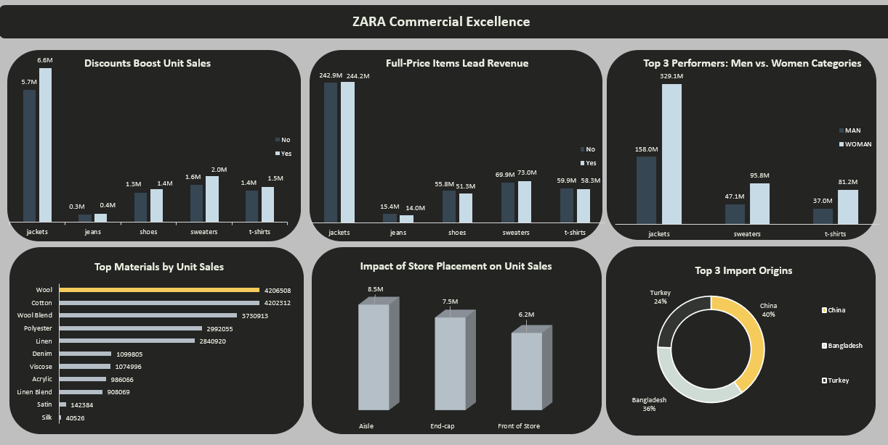

# Interactive Multi-Page Sales & Operations Dashboard (ZARA Case Study)

## 📌 Project Overview
This project presents a comprehensive analysis of **ZARA's Sales & Operations**. The goal was to transform raw sales data into an interactive visual story that helps decision-makers understand consumer behavior, seasonal trends, and revenue drivers.

## 📊 Dashboard Preview

## 🚀 Key Features
- **Multi-Page Navigation:** Interactive tabs for seamless switching between Sales Volume, Total Revenue, Categories, and Seasonal Analysis.
- **Dynamic Slicers:** Ability to filter data by Season, Category, Section, and Promotion status for deep-dive insights.
- **Visual Storytelling:** Modern Dark-Theme design with high-contrast charts for better readability and professional presentation.

## 🛠️ Tech Stack & Tools
- **Data Cleaning & Transformation:** Excel (Pivot Tables).
- **Analysis:** Descriptive Statistics and Trend Analysis.
- **Visualization:** Advanced Excel Dashboarding with customized shapes and interactive elements.

## 📈 Business Questions Addressed
- Which product categories drive the highest sales volume?
- How do promotions (Yes/No) impact the total revenue across different seasons?
- What is the relationship between product positioning (Aisle vs. End-cap) and performance?
- Which materials (Polyester, Cotton, Linen, etc.) are trending in specific seasons?

## 📁 Repository Structure
- `Data/`: Contains the cleaned dataset used for the analysis (`Business_sales_EDA.csv`).
- `Dashboard/`: Contains the final interactive Excel file and dashboard screenshots.

---
**Developed by Abdelrahman Ibrahim** *Data Management Specialist | Data Analyst*
